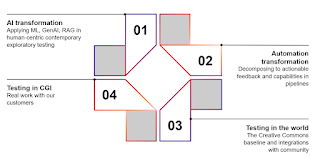
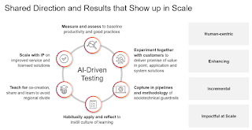

# Habit of AI in Quality Engineering

*Published 2025-11-25*  
*Source: <https://visible-quality.blogspot.com/2025/11/habit-of-ai-in-quality-engineering.html>*

---

It was June 2024, and I was preparing to meet a journalist for an interview due to my recent appointment as Director for AI-Driven Application Testing at CGI Finland. The journalist drove the interview with two requests:

- Demo and show!
- What is our approach at CGI on this

New to the company, it took me a bit of reflecting on what is our approach and if we have \*one\* or \*many\* approaches. A year and a half later is a good time to reflect on the ideas I put together back then, and what my reality ended up looking like.

For the demos I chose back then, I had three:

**GenAI code reviews** and even if I had ended up with production experience, I still follow on a monthly basic the slow start of using genAI code reviews in customer projects. After all, the bottleneck with genAI moved from writing code to reading code, and some reports include numbers such as writing code 2-5x as fast, but code reviews being 90% slower.

**GenAI pair testing** and using commonly available genAI tools as external imagination for purposes of exploratory testing. After all, from screenshot to ideas and observations, I already had more help from the tools than from majority of tester colleagues too focused on empirical proofreading of requirements.

**Digital twinning for a test expert** was already on version 2 as people at CGI had used my CC-BY materials to experiment with genAI helper that would have my ideas of exploratory testing as context. While I might not need the answer of what would I advise, it was a fun demo of insights of having been building a base for being able to do this for two decades of open materials.

**Copiloting test automation** code with polyglot approach of various languages and driving forward relevant efforts towards automating tests. After all, we tend to want deterministic examples we can track rather than regenerated things moving control away from whoever is operating the quality signaling efforts. What made this interesting is the foundation of hands-on experience from 2021 onwards and the roman numerals example where humans outperform the genAI.

There were things at the company I had not become aware of back then, that all had later an impact on how I would think about building the habits

- **CGI DigiShore** is an AI solution for modernizing legacy applications. I found a lot of value in generating artifacts to understand yesterday's code for testing purposes, and building concepts towards DigiShore Coverage for Testing.
- **CGI AppFactory** is a delivery concept where we optimize delivery teams of humans and agents. While the official messaging might not so say, I learned from discussions with my fellow developers  that regardless of titles, the delivery mode has a foundation in exploratory testing and understanding how we would continuously explore while documenting tests with modern automation.
- **CGI Navi** is an artifact generator that can be run in hosted mode when all your data should not leave and ship to someone further away. With it I learned more on contractual trust relationships between organizations, and driving genAI use forward in practice even when that trust for some sets of data cannot be in place.

I didn't only look at CGI Intellectual Property, but the wider community with our partners, whatever was cooking in the ways AI was making its way to commercial testing tools for test repositories, test automation and test data, and what became available in open source as well as in Finland.

In hindsight, that 1.5 years was well used in modeling the AI black box for function and structure making comparisons and recognizing uniqueness of approaches easier. It allowed for recognizing the need of a choice to build a stronger habit of AI in quality engineering in practice, and thus now drive forward a **significant agent-to-human -ratio for contemporary exploratory testing**.

Looking back at the slides and the reality that unfolded. I decided in June 2024 that my approach towards the change we need in testing would be four steps:

We have established our understanding with AI we continue to collaborate on observing and integrating the latest in the field. We have recognized the automation transformation needs significant work and is both a foundation for AI in testing and any modernized approaches to software development with worthwhile quality signaling. We have started moving selected public materials to our open source for test sharing (<https://github.com/QE-at-CGI-FI>) and adjusted my previously used CC-BY to CC-BY-NC-SA, and open yet more restrictive license. This reflect what brought me to CGI: industrialization at scale of resultful exploratory testing I learned to teach over the last three decades. And finally, we have done what we do with our clients and their various stakeholders, often in multivendor teams.

Building the habit of AI has required deeper understanding of data sensitivity classifications, isolating different sensitivity data, negotiating reasonable sandboxes for use of leading packaged genAI tooling both from a UI and programmatically from APIs, and having those sensitivity considerations leading to a hosted solution. It has driven my personal explorer's agent to human ratio to over 20, and while measuring time it saves isn't feasible, it is driving a real change in how I test with **contemporary exploratory testing** with a pipeline of task-based agents to capture some knowledge we have previously accepted as tacit.

Finally, the journalist asked me for the approach. For the approach, I combined all that is dear to me:

- Resultful testing where the level of practice needs to be better than what we experience in scale
- Scaling habits by democratizing knowledge, and allowing time to learn in layers
- Open information while working towards business incentives that allow for sustainable work
- Learning by doing, learning by teaching
- Scaling by practices and tools
- Better quality signals with metrics

The community, both at CGI and at large has been on this journey with me. With a variety of clients more curious than ready for the change of habits, our habits take a continuous balance of awareness of where in the journey we are with different clients.

If back then I was unsure if there needed to be one way or if this way fits, I now know I work in a community of curious professionals that see cultivation of many routes and integrating for greater benefit something of value. Some corporations are built as community.
