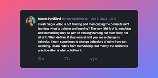

# Learning, and why agency matters

*Published 2026-01-06*  
*Source: <https://visible-quality.blogspot.com/2026/01/learning-and-why-agency-matters.html>*

---

Some days Mastodon turns out to be a place of inspiration. Today was one of those.

It started with me sharing a note from day-to-day at work, that I was pondering on. We have a 3 hour Basic and Advanced GitHub Copilot training organized at work that I missed, and I turned to my immediate team asking 1-3 insights of what they learned as they were at the session. I knew they were at the session because I had approved hours that included being in that session.

I asked as a curious colleague, but I can never help being also their manager at the same time. The question was met with silence. So I asked a few of the people one on one, to learn that they had been in the session but zoned out for various reasons. Some of the reasons included having hard time to relate to the content as it was presented, the French-English accent of the presenters, getting inspired by details that came in too slow taking time to search information online on the side and just that the content / delivery was not particularly good.

I found it fascinating. People take 'training' and end up not being trained on the topic they were trained on, to a degree they can't share one insight the training brought them.

For years, I have been speaking on the idea of **agency**, sense of being in control, and how important that is for learning-intensive work like software testing. Taking hours for training and thinking about what you are learning is a great way of observing agency in practice. You have a budget you control, and a goal of learning. What do you do with that budget? How do you come out having used that budget as someone who know has learned? It is up to you.

In job interviews when people don't know test automation, they always say "but I would want to learn". Yet when looking back at their past learning in space of test automation, I often find that the "I have been learning in past six months" ends up meaning they have invested time in watching videos, without having being able to change anything in their behaviors or attain knowledge. They've learned awareness, not skills or habits. My response to claims of learning in the past is to ask for something specific they have been learning, and then asking to see if they now know how to do it in practice. Most recent example in this space was me asking four senior test automator candidates on how to run robot framework test cases I had in IDE - 50% did not know how. We should care a bit more about our approaches to learning in terms of it is impactful.

So these people, now including me, had the opportunity of investing 3 hours to learning GitHub Copilot. Their learning approach was heavily biased on the course made available. But with strong sense of agency, they could do more.

They could:

- actively seek the 1-3 things to mention from their memories
- say they didn't do the thing and in the same time they did Y and learned 1-3 things to mention
- not report the hours into training even if the video was playing while they did something completely unrelated
- stop watching the online session and wait for video to have control over speed and fast-forwarding to relevant pieces
- ...

In the conversations on Mastodon, I learned a few things myself. I was reminded that information intake is a variable I can control from high sense of agency in my learning process. And I learned there is a concept of 'knowledge exposure grazing' where you are snacking information, and it is a deliberate strategy for a particular style of learning.

Like with testing, being able to name our strategies and techniques allows us control and explainability to what we are doing. And while I ask as a curious colleague / manager, what I really seek is more value for the time investment. If your learning teaches others in a nutshell, you are more valuable. If your learning does not even teach you, you are making poor choices.

Because it's not your company giving you the right trainings, it's you choosing to take the kinds of trainings in the style that you know works for you. Through experimentation you learn what are the variables you should tweak. And that makes you a better learner, and a better tester.

