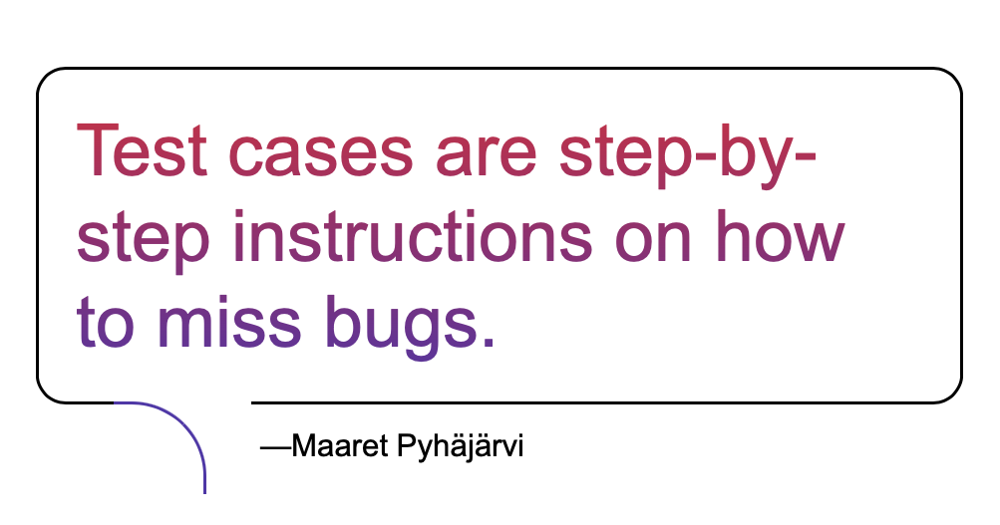

# Requirements lead into worse testing?

*Published 2026-02-13*  
*Source: <https://visible-quality.blogspot.com/2026/02/requirements-lead-into-worse-testing.html>*

---

With the exercise on testing a version of ToDo app, any constraint handed to people as part of the assignment looks like it primes people to do worse.

If I give people a list of requirements, they stop at having verified the requirements, and reporting something they consider of value, without considering the completeness of their perspective or complementing constraints.

If I give people list of test cases or automation, they run those, and their entire judgement on the completeness is centered around whether those pass.

If I give them the application without a constraint, they end up constrained with whatever people before me have asked them to do in the name of testing. All too often, it's the ask for "requirements", as a source of someone else constraint for their task at hand.

When seeing that this year I would hand out the requirements, the feedback from a colleague was that this would make the task easier. It made it harder, I think. What I find most fascinating though is why would people think this makes it easier when it creates an incorrect illusion of a criteria to stop at. Another colleague said they vary what they do first, with or without the requirements, but they will do both. That is hard-earned experience people don't come with when they graduate.

Giving the assignment with requirements to someone, they came with 7 and certainty of having completed the assignment where the hidden goal is at 73. Should I have primed people for success telling them they are looking for 100 pieces of feedback, prioritized by what they consider me most likely to care on.

That is, after all, the hidden assignment when testing. Find them and decide what matters. Tell forward about what matters, for that particular context at hand.
