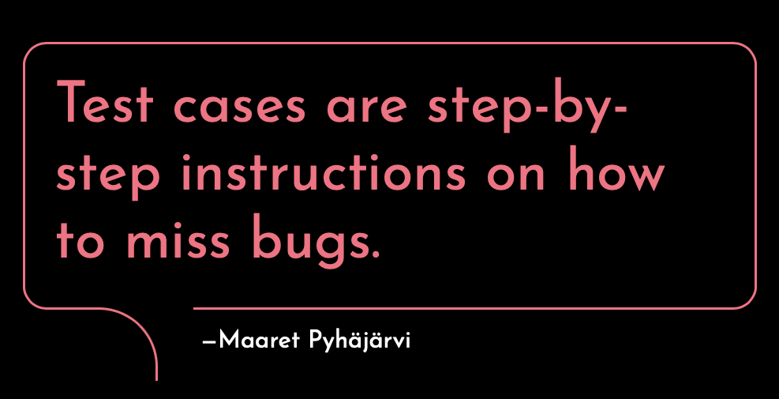

# Why would I even want to generate test cases with AI?

*Published 2026-03-09*  
*Source: <https://visible-quality.blogspot.com/2026/03/why-would-i-even-want-to-generate-test.html>*

---

There is a conversation I keep having on use of AI, where people ask me about *generating test cases with AI* and I explain them that test cases was never the thing we wanted in the first place. Puzzled? You might not be yet aware of what **exploratory testing**really is if you are, and if you were, you would be better equipped for the AI transformation in testing we are currently in.

Testing is not about executing test cases. It is about finding information - some of what others may not know that is of relevance. Test cases are not ideas of what to test, but ideas turned into step by step instructions.

Let's not confuse *automated test cases* to test cases through. Automated test cases are captured programmatic steps that enable repeating the steps as executable documentation. Unlike test cases, automated test cases are not just repeating the same steps, but also a foundation for extending with new data, mixing step orders and thus discovering ways of not stepping instructions to miss bugs. And their design shifts testing down to a faster cycle of feedback.

We need testing to find information, but we don't need test cases. This is what we see with AI. Ask for bugs, and you get bugs. Why would you ask test cases when you wanted to know what information at least could use addressing? Ask for bugs many different ways, and all the layers might give a good level of testing done.

When we need documentation for future, we capture that as output. And we treat automation as a first class citizen as creating that asset for documentation the texts are generated from - not the other way around.

When I joined CGI Finland as Director of AI-Assisted Application Testing nearly two years ago, I had a hunch that the transformation expected included reframing testing, and supporting it with new kinds of approaches. Turns out that some of the better outcomes are founded on ideas of **contemporary exploratory testing***.* When packaged, we call it **Test Intelligence Mesh.** Fancy names aside, this is new rules on how testing is done, AI assisted, with packaged skills of great exploratory testing. One experiment at a time, collecting and sharing our toolbox that we can leave behind and scale.

I don't generate test cases, I generate valuable results of testing. And I would be a fool doing that without AI-support that helps me scale.
