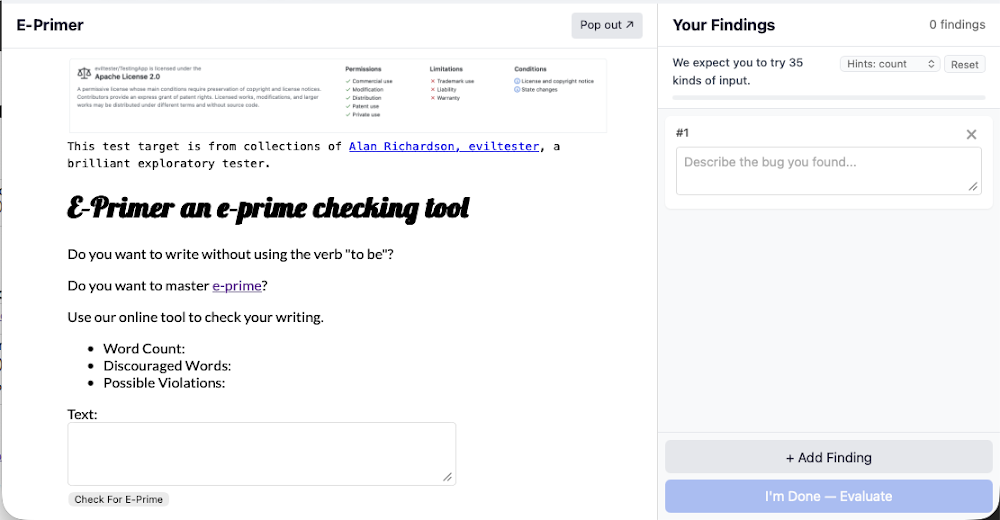
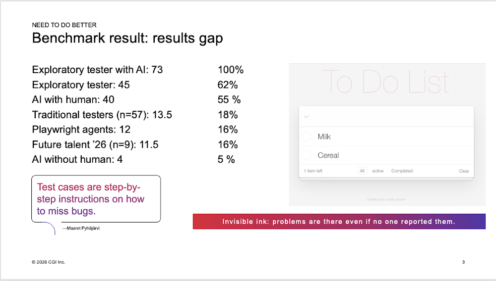
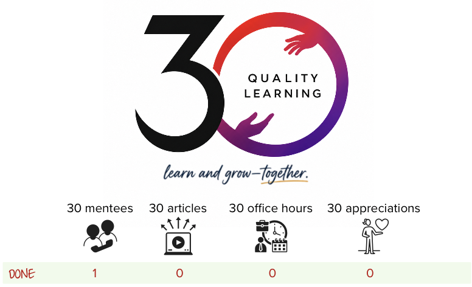

# Capture the Bugs - Feedback on learning how to test

*Published 2026-07-29*  
*Source: <https://visible-quality.blogspot.com/2026/07/capture-bugs-feedback-on-learning-how.html>*

---

You may have run into a popular learning tool in the security space, *Capture the flag*. These are essentially instrumented unsecure applications, where as you test, you get score for insighs and hints on what else could you try out as attack vectors.

Functional testing includes security testing, but in addition includes a whole lot of perspectives that may not have security implications. With that in mind, I paired with Ru Cindrea to co-create self-service version on a learning style I have used in classroom settings for decade(s) - learning testing by testing, and getting feedback founded on someone else going before you.

In this post, I want to provide you a link and current state description on work that will evolve further but would already be useful for your self-study, and talk about the background leading up to this.

## Capture the Bug Current State

You can find the application at <https://exploratory-testing-academy.github.io/capture-the-bugs/>.

It now supports two features for one test target, e-primer:

1. input coverage - you can't find problems if you can't imagine things to try out in an application. If this feels hard to do, we also included a mode where it tells you classes, or even examples.
2. results coverage - you can list things you found, and it tries to compare them with in-browser AI model to a list of 65 known bugs. It tells you what bugs we know of when you think you're done.

I should change the UI to say "We expect you to try **35 kinds of input** and report **65 issues** we know of. Traditional professional testers find 18% of bugs on other comparable test targets, and learning testing (and using AI) raises the measured bar."

That is it. Test without the answer key, without us watching you test for now. We'll eventually add a choice of reporting your results to you, but it's not there now. You get feedback on input and results coverage. For input coverage, you can choose to update the level of guidance it provides you - from usual testing with your sources of imagination, to seeing classes we had in mind without the specific examples, to specific examples to make sense of how inputs are different. Results are evaluated after you call done, with an in-browser AI component trying to match your style of reporting to our style of baselining expectations.

We would love if you reached out in socials if you try this out, or if this style of learning is interesting to you. Maaret prefers DMs in linkedin or mastodon.

## Backstory

Capture the bugs is really a step forward in a decade(s) long teaching of exploratory testing, learning to test by testing. Different test targets require different techniques, and this particular test target is heavy on inputs, while it has a lot of non-input related issues you could raise too. When hundreds of testers have tested this with me in job interviews, online pairing sessions and classrooms, I have built both an answer key to what is expected, and a course to teach you the theory around testing an application such as this. Course is available at <https://qe-at-cgi-fi.github.io/material-portal/cetf/index.html> for its latest edition.

While being aware of 65 issues on this application worth starting a conversation on, I've been doing benchmarking with other applications. For todo app, the discovery has been that people professionally paid to do testing, being put under the open schedule and required to test and report, find as little as 18% of bugs. This benchmarking has been both a motivation for working towards better, more accessible testing education on *resultful testing* where you decide actively on acceptable risks, rather than miss out on conversations you could be leading. The very same benchmark has been a sad realization on the testers at large on not delivering on our value proposition on being allowed to focus on quality.

At my 30th year on testing, I am even more focused on scale and legacy, and transforming from someone who loves to do testing to someone who grows more people who love to do testing. Testing is a great profession, but it is not an easy one. It is endless learning, collecting stories of bugs of relevance while walking a minefield of intentionally left behind issues. There is great hope for its future with task expansion, and the idea that to report a bug with AI is to fix it and leave behind test automation that tracks our expectations.

Capturing some more of the learning, one piece of action at a time.
